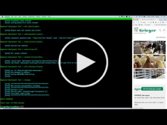

# Magento 2 Deployment tool

Deployment tool for Magento 2 created with [PHing](https://www.phing.info/). This tool builds a new project version into a separate directory and switches live version at the end.

Workflow:

```
1. Get new Project version (i.e git clone, curl, ...)
2. Build Project (i.e composer install, untar, ...)
3. Symlinks to shared content in server
4. Generate Magento files (Skipped if deploying `.tar`)
5. Set folder/files permissions
6. Set Maintenance
7. Database backup
8. Magento setup:upgrade
9. Replace live version with new one
10. Unset maintenance
11. Clean up old releases and backups
```

## Demos

* Deploying git repo

<a href="http://www.youtube.com/watch?feature=player_embedded&v=JFDen6iXMko
" target="_blank"></a>

* Deploying .tar archive

<a href="http://www.youtube.com/watch?feature=player_embedded&v=JqmZTjbmDwo
" target="_blank"></a>

## Installation

Global installation using composer is required.

0. Composer require:

	```
	composer global require "staempfli/magento2-deployment-tool":"dev-master"
	```

0. Check you global composer `bin-dir` configuration:

	```
	composer global config -l | grep "bin-dir"
	```

0. Add path from previous step into your `$PATH` configuration:
0. Open a new console tab and check that `mg2-deployer` tool is found

	```
	which mg2-deployer
	```

## Setup

0. File `config.php` is required to come within the project cloned.

	* You can follow the following documentation if you do not have your project configured like that yet:
		* [docs/setup/config-php.md](docs/setup/config-php.md)

0. Create Database:

	```
	 CREATE DATABASE <database_name>;
	 CREATE USER `<database_user>`@`<database_host>` IDENTIFIED BY "<user_password>";
     GRANT ALL ON <database_name>.* TO `<database_user>`@`<database_host>`;
	```

0. Run Setup: (this might take several minutes because of magento compilation)

	```
	mg2-deployer setup
	```

0. At the end of the process you should get a folder structure similar to this:

```
  | - backups
  | - deployment-settings
  | - public_html (Symlink)
  | - releases
  | - tmp-downloads
  | - shared
    | - magento
    	| - app (etc/env.php)
    	| - pub
    		| - media
    	| - var
    		| - log
```

## Usage

Tool must be executed at the path where the the project will be deployed.

* Deploy new releases:

	```
	$ mg2-deployer release
	```

* Other avaiable commands:

	```
	$ mg2-deployer -list

	Main targets:
	------------
 	release               Options -> [keepMaintenanceSet|skipDatabaseBackup]
 	maintenance:set       Set maintenance window
 	maintenance:unset     Replace maintenance window with a specific released version
 	release:live:replace  Set a specific release as live version
    cache:clean:all       Clear all caches (Magento, OPcache, Varnish)
	```


## Custom Configuration


### Properties

You can customise all properities according to your needs:

* Properties added in `deployment-settings/project.properties` have the highest priority and will overwrite default ones
* You can check all default properties that can be customised on:
	* [build/config/default.properties](build/config/default.properties)

### Maintenance Window

You can edit the maintenance file with your own design:

```
vim deployment-settings/templates/maintenance/${magento.dir}/pub/index.php
```

### Shared content & Symlinks

* Static content that is only relevant on the server will be kept into the `shared` folder.
* Symlinks are created automatically in the released project during every deployment.
* You can add your custom symlinks by editing the file `deployment-settings/shared.symlinks`

	```
	shared/magento/app/etc/env.php=>{{MAGENTO_DIR}}/app/etc/env.php
	shared/magento/pub/media=>{{MAGENTO_DIR}}/pub/media
	shared/magento/var/log=>{{MAGENTO_DIR}}/var/log
	```
	* Note that you must replace `{{MAGENTO_DIR}}` with your magento dir or `.` if same as root project.

### Scripts

You can set custom scripts to run at the end of the release process on the following file:

```
cp deployment-settings/scripts/release-after.sh.dist deployment-settings/scripts/release-after.sh
vim deployment-settings/scripts/release-after.sh
```

## Advanced Configuration (for CI/CD env)
If you are smart, you probably have a CI/CD environment where you already build the project and create a `tar` archive. Then you probably want to skip Magento generation files (assets & compilation) during the deployment.

You can do that by setting this configuration in `deployment-settings/project.properties`:

```
magento.generate.files=0
command.get.project.version=scp <user>@<server_domain>:<path>${release.version}.tar.gz ${downloads.target}.tar.gz
command.build.project.version=tar -xzf ${downloads.target}.tar.gz -C ${release.target}

command.get.project.snapshot=${command.get.project.version}
command.build.project.snapshot=${command.build.project.version}
```

**NOTE** `${}` variables are automatically replaced during deployment.


## Tips:

### Speed up deployment process on dev-servers:

* Release most recent version of develop branch `-Drelease.version=snapshot`
* Skip database backup step `-DskipDatabaseBackup`
* You can even set these options by default on `deployment-settings/project.properties`:

    ```
    vim deployment-settings/project.properties
    release.version=snapshot
    skipDatabaseBackup=1
    ```

## Troubleshooting

####Compilation error

* **Solution**: Increase php `memory_limit` configuration to 728M o 1024M


## Prerequisites

- PHP >= 7.0.8
- MAGENTO >= 2.1.1

## Developers

* [Juan Alonso](https://github.com/jalogut)

Licence
-------
[GNU General Public License, version 3 (GPLv3)](http://opensource.org/licenses/gpl-3.0)

Copyright
---------
(c) 2016 Staempfli AG